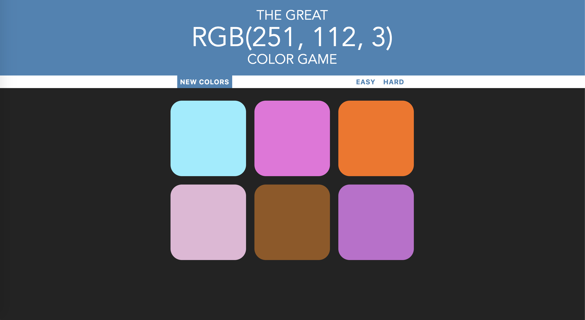

# Color-Game
This game was created as part of this web development course to gain a better understanding of the power of JavaScript, HTML, and CSS to easily create a slick looking, interactive game. 

> A JavaScript project from the Udemy course - [The Web Developer Bootcamp by Colt Steele](https://www.udemy.com/the-web-developer-bootcamp/)

